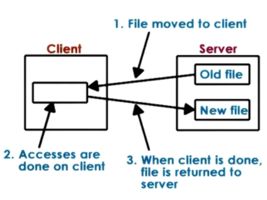
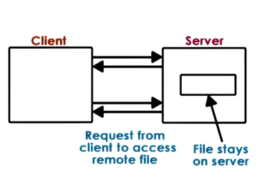

# Distributed File Systems

- Accessed via well defined interface
	- access via Virtual File Systems
- Focus on consistent state
	- tracking state, file update, cache coherence
- Mixed distribution models possible 
	- replicates vs partitioned, peer-like systems
    
## DFS models

- Client Server on different machines
- File server distributed on multiple machines 
	- replicated (each server : all files)
    - partitioned (each server : parts of files)
    - both (files partitioned, each partition replicates)
- Files stored on and served from all machines (peers)
	- blurred distinction between clients and servers
    
## Remote File Service : Extremes

1. Extreme1 : Upload/Download
	- like FTP, SVN 
    - **\+** local read/writes at client
    - **\-** entire file download/upload evn for small accesses
    - **\-** server gives up contro;
2. Extreme2 : True Remote File Access
	- Every access to remote file, nothing done locally
    - **\+** file access centralized, easy to reason about consistency
    - **\-** every file operation pays network cost, limits server scalablity
    
## Remote File Service : A compromise

A more practical Remote File access (with Caching)

1. Allow clients to store parts of files locally (blocks)
	- **\+** low latency on file operations
    - **\+** server load reduces => more scalable
2. Force clients to interact with server (frequently)   
	- **\+** server has insights into what clients are doing
    - **\+** server has control into which accesses can be permitted => easier to maintain consistency
    - **\-** server more complex, requires different file sharing semantics
    
## Stateless vs Stateful File server    

Stateless | Stateful
----------|----------
Keeps no state; Okay with extreme models, but can't support 'practical' model|Keeps client state needed for 'practical' model to track what is cached/accessed
**\-** Can't support caching and consistency management|**\+** Can support locking, caching, incremental operations
**\-** Every request self-contained. => more bits transferred|**\-** Overheads to maintain state and consistency. Depends on caching mechanism and consistency protocol.
**\+** No resources are used on server side (CPU, MM). On failure just restart|**\-** On failure, need checkpoining and recovery mechanisms

## Caching state in a DFS

* Locally clients maintain portion of state (e.g. file blocks)
* Locally clients perform operations on cached state (e.g. open/read/write)
* requires coherent mechanisms

|How|When|
---|----|----|----|
SMP|Write-update/Write-invalidate|On write
DFS|Client/Server-driven|On demand, periodically, on open.. 

* Files or File blocks can be (with 1 server and multiple clients) cached in:
	- in client memory
    - on client  storage device (HDD/SDD)
    - in buffer cache in memory on server
    	- (usefulness will depend on client load, request interleaving)
        
* File Sharing Semantics in DFS

* Session semantics (between open-close => Session)
	- write-back on close(), update on open()
    - easy to reason, but may be insufficient
* Periodic updates
	- client writes-back periodically
    	- clients have a "lease" on cached data (not exclusively necessary)
	- servers invalidates periodically => provides biunds on "inconsistency"
    - augment with flush()/sync() API
* Immutable files => never modify, new files created
* Transactions => all changes atomic

# Replication vs Partitioning

|Replication | Partitioning
-----|------------|-----------
|Each machine holds all files|Each machine has subset of files
Advantages|Load balancing, availibility, fault tolerance|Availibility vs single server DFS; Scalability with file system size; single file writes simpler 
Disadvantages|Write becomes more complex - Synchronous to all - or, write to one, then propagate to others replicas must be reconciled e.g. Voting|On failure, lose portion of data load balancing harder, if not balanced, then hot-spots possible

* Can combine both techniques
	- Replicate each partition!
    

    

    
    